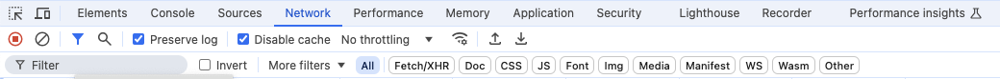
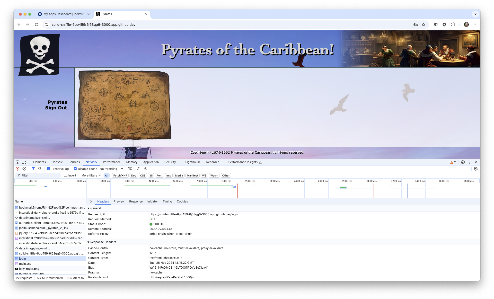
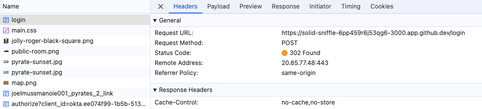
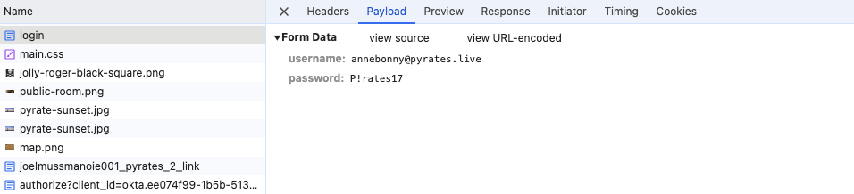

[//]: # (README.md)
[//]: # (Copyright © 2024 Joel A Mussman. All rights reserved.)
[//]: #


## “Beware the Jabberwock, my son! The jaws that bite, the claws that catch!"

# Okta Secure Web Authentication

## Advantages and Vulnerabilities

Okta SWA is fundamentally a password management system.
The Okta Browser Plugin is required to monitor web pages and step in to provide credentials when a registered application is visted.
The plugin retrieves the credentials from the Okta tenant and effectively provides single sign-on for the page.
There are some distinct advantages:

* Credentials are stored at the Okta tenant, not on the user device where they are vulnerable to malware
* Credentials may be managed by the user or the administrator, and the administrator can block user management
* The plugin supports multiple users and multiple tenants

Blocking user credential management and not storing passwords at the tenant
often leads to an expectation of privacy on the part of the Okta administrator, a mistaken belief
that the credentials are secure through to the application.
This is not actually true.

The Okta Browser Plugin handles the credentials securely, but it must present them to the application by
inserting them in form fields on the login page that the application presents.
This is true of both web and single-page applications.
Those credentials are sent to the application via a network request.
Both the form fields and the network traffic give a user or malware an opportunity to capture those credentials.

This is not a failing of the Okta engine.
It is an unavoidable pitfall of having to support thousands of Software as a Service (SaaS) applications
that refuse to move to more secure forms of authentication.
Simply a fact of life in the SaaS world.

What follows is a simple lab which manually defeats the secrecy of the the credentials used to authenticate with the app.
The purpose is to educate administrators to have
clear expectations and make informed decisions,
such as never assume that your workforce has not obtained the credentials to access an application.
Which means that a change to a user during lifecycle management also means a forced change to the application credentials.

# Compromise SWA credentials

This process requires nothing more than configuring an SWA application in an Okta tenant and
configuring the browser to expose the credentials when the Okta plugin passes them.

Some familiarity with running commands in a terminal or
PowerShell window, the browser developer tools, and following the log of network calls in developer tools is a plus.

You will also need to be signed into a GitHub account if you want to launch a GitHub Codespace to run the applicaiton.
You are already here at GitHub!

## Before you begin

This process requires launching the browser with the developer tools open in every new tab, in order
to see the developer tools in the tab the Okta Browser Plugin opens the application in.
The tools may be opened using the command line with Google Chrome and Microsoft Edge.
Because other browers require a plugin to make that happen they will not be addressed here, although you
may research that yourself to try.

The Okta Browser Plugin does not support Microsoft Edge running in IE compatibility mode
(see the [Okta Help Center](https://support.okta.com/help/s/article/The-Okta-Browser-Plugin-Does-Not-Work-in-Internet-Explorer-IE-Mode-on-Microsoft-Edge?language=en_US)), and unfortunately
that is something controlled by your enterprise via group policies (we cannot fix it here).
If you plan on using Edge test it to see if the plugin actually provides SSO for any SWA application before you begin.
This may be an issue you are already familiar with in your organization.

## Step 1: Configure the application

This repository includes an application with primitive authentication like many
Software as a Service (SaaS) vendors provide.
The repository may be cloned and the application executed locally, or a GitHub Codespace may be launched from
GitHub and the application will self-start.

### Clone and run locally

1. Copy the GitHUb path and clone the project locally (NodeJS is required, this build is tested with NodeJS 20).
1. In a terminal window open to the project run *npm install*.
1. Run *npm start* to launch the application.
1. The URL to reach the application is always http://localhost:3000, that is what will be configured at Okta.

### Run in a GitHub Codespace

1. You must be logged into your own GitHub account to launch a Codespace.
1. In this repository click the green *Code* button.
1. In the popup select the *Codespace* tab and click the green *Open in Codespace* button.
1. A new tab will open with a random Codespace name, make sure you are viewing it.
1. Wait for the Codespace to build and the application to launch; a message indicating it is listening will appear on the VSCode terminal window.
1. Make a note of the Codespace URL where the application is listening, this is what will be configured at Okta.

### Testing the application (locally or in a Codespace)

For either the local or Codespace application visit the URL and make sure the application launches.
If you are using Codespace you may get an intermediate window warning you about connecting to another user's codespace, but it is really your own.
Valid usernames and passwords to test the pplication with are (they all have the same password):

| Username | Password |
| --- | --- |
| calicojack@pyrates.live | P!rates17 |
| blackbeard@pyrates.live | P!rates17 |
| blackcaesar@pyrates.live | P!rates17 |
| annebonny@pyrates.live | P!rates17 |
| maryread@pyrates.live | P!rates17 |

## Step 2: Create an application integration in Okta

This step is a normal integration; a basic understanding of Okta administration is expected:

1. Under Applications &rarr; Applications click the *Create App Integration* button and use the Application Integration Wizard (AIW) to start a new integration.
1. Pick *SWA - Secure Web Authentication* as the type and click the *Next* button.
1. Set *Pyrates* as the integration name.
1. Add the path /login to the URL as discovered in the previous section, and set that as the URL for the application.
For example, *https://solid-sniffle-6pp459r6j53qg6-3000.app.github.dev* becomes *https://solid-sniffle-6pp459r6j53qg6-3000.app.github.dev/login*.
The path is important, /login is the path the Okta plugin is looking for.
A local application will run forever but a Codespace will time out if a user does not interact.
Restarting the Codespace will result in the same URL. 
1. Open the application Sign On tab, edit the settings, and pick *Users share a single username and password set by administrator* as the method.
1. Set *annebonny@pyrates.live* and *P!rates17* as the shared username and password and save the changes.
1. Assign an Okta user to the application integration for testing.
1. With the application running locally or in a Codespace sign on to Okta as the user and test the application.
This may require installing and authenticating with the Okta Browser Plugin in your browser if you have not already done that.
If you are running the application in a Codespace, the warning window about visiting another Codespace application may interfere with
the Okta Browser Plugin passing the credentials.
If that happens and single sign-on fails, close the application window and launch it again from the dashboard.
It should work the second time.
1. Close the browser tab containing the application once it is working.

## Step 3: Configure Chrome or Microsoft Edge to capture information

In order to investigate the application Okta launches, the developer tools must automatically
open in the browser window for the application.
This requires launching Chrome or Edge with the option turned on before invoking the
application from Okta.
The option will not work if any copies of the browser are already running when used.

### Using Microsoft Windows

1. Close all visible copies of Chrome or Edge, whichever you have chosen to use.

1. Google Chrome and Microsoft Edge may continue to run in the background
after the windows is closed.
Open the task manager, search for "chrome" or "edge", and end any running tasks:

    

1. From Windows Powershell launch Chrome or Edge with the option to start developer tools
with one of these commands:
    ```
    PS > start chrome --auto-open-devtools-for-tabs
    PS > start msedge --auto-open-devtools-for-tabs
    ```

### Using Apple MacOS

1. Close all visible copies of Chrome or Edge, whichever you have chosen to use.

1. Both Chrome and Edge leave the application running in memory after the windows are
closed.
Open a Terminal window and end any processes with one of these commands:
    ```
    $ pkill "Google Chrome"
    $ pkill "Microsoft Edge"
    ```

1. From a Terminal window launch Chrome or Edge with one of the following commands:
    ```
    $ open -a "/Applications/Google Chrome.app" --args --auto-open-devtools-for-tabs
    $ open -a "/Applications/Microsoft Edge.app" --args --auto-open-devtools-for-tabs
    ```

### Set network options (for both Windows and MacOS)

1. In the browser tab that opened in the previous step ensure the developer tools panel is open.

1. Click the *Network* section.

1. Make sure the *Preserve Log* and *Disable Cache* options are selected.
*Disable Cache* to make sure new copies of the pages are always loaded.
*Preserve Log* to make sure the network history is preserved as the page changes in the browser:

    

## Step 4: Codespace only!

If you are running the application in Codespace, the browser window will have been closed during the reconfiguration in step 3:

1. Log into GitHub.

1. Click on the "hamburger" menu for GitHub at the upper left, next to the cat icon.

1. Click on the *Codespaces* menu item.

1. Locate the Codespace associated with the repository *okta-beware-swa*.

1. Click the elipses menu at the end of the line (...) and choose *Open in browser*.

1. Wait for the Codespace to load and the application to launch.

## Step 5: Isolate the form POST with the credentials

1. Sign on to the Okta user dashboard in the Okta tenant.

1. Launch the Pyrates application by clicking the application tile on the dashboard.

1. Look through the network log for the first call to the /login path, click on it to see this is the GET request:

    

1. Below that look for the second call to the /login path, this is the POST request where the credentials are sent:

    

5. Look at the *Payload* tab; this contains the credentials for the application.
Wala!

    

If this was a single-page application (SPA) you will have to do a little more digging
in the network traffic to see where the
JavaScript sent the credentials to a web service (API) for verification.
But, it will be there!

Clearly, even when credential management is taken away from a user they could have previously captured those credentials.
If the user can capture it, then malware can capture it too.

So when user roles change, or when users are off-boarded, then any credentials they had assigned are now
suspect.
If the credentials are not changed, there is reasonable to conclude the user may leverage those credentials to access an application
they no longer are assigned to.
So SWA credentials must be changed whenever a user is unassigned.
Or more frequently.

## Step 6: Put the browser back to normal (so you can work!)

1. Close all browser windows.

1. Terminate any running browser processes (refer back to step 3).

1. Confirm that opening a browser will not automatically launch the developer tools.