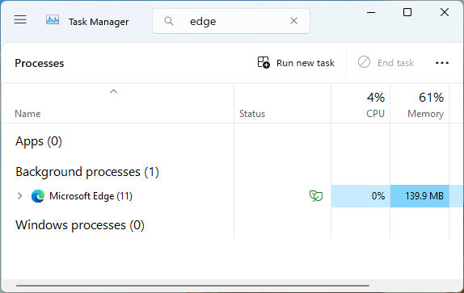
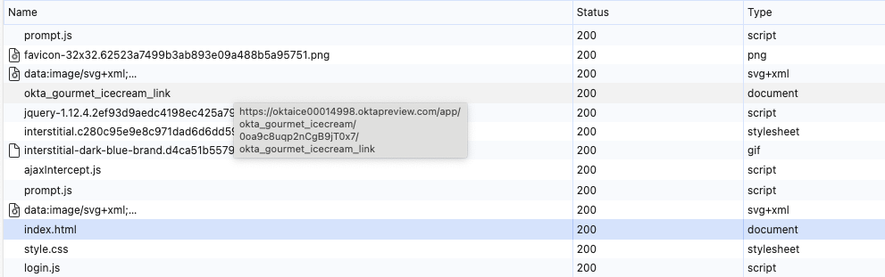
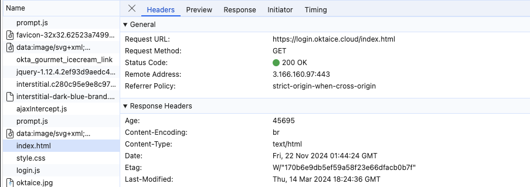
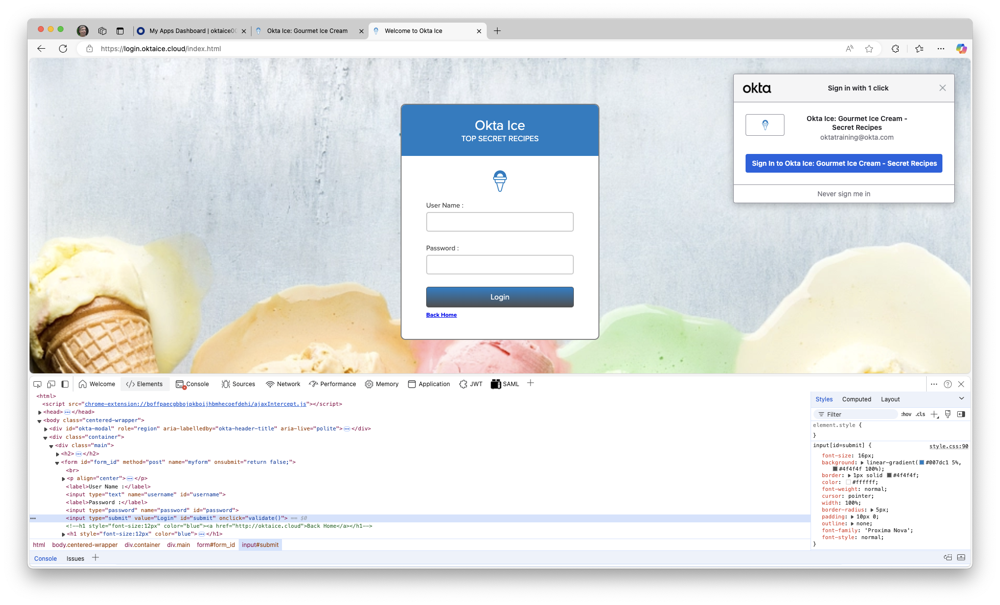
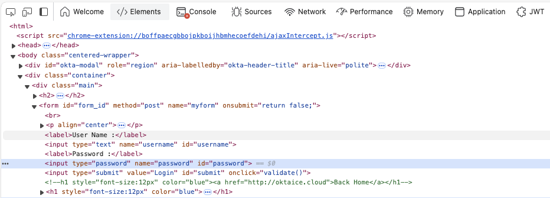
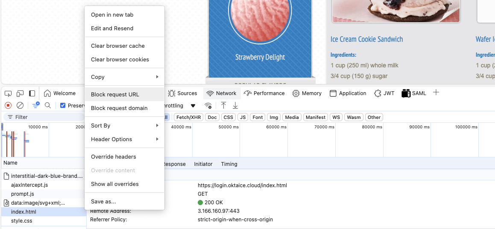
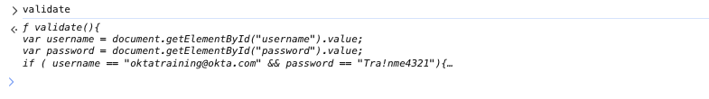
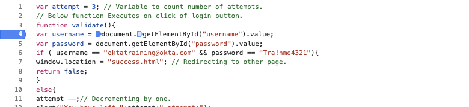
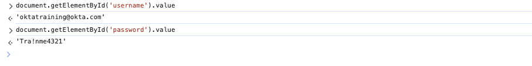

[//]: # (README.md)
[//]: # (Copyright © 2024 Joel A Mussman. All rights reserved.)
[//]: #


# Okta Secure Web Authentication

## Advantages and Vulnerabilities

Okta SWA is fundamentally a password management system.
A browser plugin is required to monitor web pages and step in to provide credentials when a registered application is visted.
The plugin retrieves the credentials from the Okta tenant and effectively provides single sign-on for the page.

* Credentials stored at the Okta tenant, not on the user computer
* Credentials may be managed by the user or the administrator
* The plugin supports multiple users and multiple tenants simultaneously

Blocking user credential management and not storing passwords at the tenant
often leads to an expectation of privacy on the part of the Okta administrator, a belief
that the credentials are secure through to the application.
This is not actually true.

What follows is a lab defeating the secrecy of the the credentials used to authenticate with the app.
The intention is not to disparage Okta SWA, rather the purpose is to educate administrators to have
clear expectations and make informed decisions.

# Compromise SWA credentials

This process will use nothing more than the browser to expose the credentials the Okta plugin is sending
to provide SSO for a user into an application.


There will be configuration of the application in an Okta tenant, and there will be a requirement
to do some configuration in the browser space to get developer tools to appear when Okta launches the application.

Some familiarity is required with running commands in the Terminal or
PowerShell, browser developer tools, following network calls in developer tools,
HTML forms, and JavaScript. 

## Configure the application

This project includes an application that provides a primitive authentication, but like many
Software as a service (SaaS) vendors provide.
The project may be cloned and the application executed locally, or a Microsoft Codespace may be launched from
GitHub and the application will self-start.

### Clone Locally

1. Clone the project locally.
1. In the terminal window run "npm install".
1. Run "npm start" to launch the application.
1. The URL to reach the application is always http://localhost:3000.

### Run in a GitHub Codespace

1. Click the "Code" button on the repository at GitHub.
1. Click the "Open in Codespace" button.
1. Wait for the Codespace to build and the application to launch; a message with the URL will appear on the terminal window.
1. Make a note of the Codespace URL where the application is listening.

In either case visit the URL and make sure the application launches.
Valid usernames and passwords too test the pplication with are:

| Username | Password |
| --- | --- |
| calicojack@pyrates.live | P!rates17 |
| blackbeard@pyrates.live | Pirates17 |
| annebonny@pyrates.live | Pirates17 |

## Create an application integration in Okta

The next step is pretty straightforward, an understanding of Okta administration is expected.

1. Use the Application Integration Wizard (the "Create an App Integration" button) to start a new integration.
1. Pick a Web Application and SWA as the type.
1. The name is not important, "Pyrates" is suggested.
1. The URL will be the URL for tha application.
Codespaces will time out if the user does not interact, but restarting a Codespace will  shuts down, 
1. Pick the same username and password for all users and configure one of the credentials above, perhaps "annebonny@pyrates.live" and "P!rates17".
1. Assign a user to the application integration for testing.
1. With the application running, sign on as the user and test the application.

## Configure Chrome or Microsoft Edge to capture information

Ensure the Okta plugin is installed in the browser and linked to the organization that
has the SWA application configured.
Test the application from the Okta dashboard to make sure it launches correctly.

In order to investigate the application Okta launches, the developer tools must automatically
open in the browser window for the application.
This requires launching Chrome or Edge with the option turned on before invoking the
application from Okta.
The option will not work if any copies of the browser are already running when used.

#### Using Microsoft Windows

1. Close all visible copies of Chrome or Edge.

1. When Microsoft Edge is launched by clicking the application icon it
continues to run in the background after the window is closed.
Open the task manager, search for "edge", and end any running tasks:

    

1. From Windows Powershell launch Chrome or Edge with the option to start developer tools
with one of the following commands:
    ```
    PS > start chrome --auto-open-devtools-for-tabs
    PS > start msedge --auto-open-devtools-for-tabs
    ```

1. In the developer tools panel open settings (the gear in Chrome or the menu in Edge).
In the section for the Network enable "Preserve Log", "Record Network Log",
and "Network request blocking":

    

#### Using Apple MacOS

1. Close all visible copies of Chrome or Edge.

1. When Microsoft Edge is launched by clicking the application icon it
continues to run in the background after the window is closed.
Open a Terminal window and terminate any Edge processes:
    ```
    $ pkill "Microsoft Edge"
    ```

1. From a Terminal window launch Chrome or Edge with one of the following commands:
    ```
    $ open -a "/Applications/Google Chrome.app" --args --auto-open-devtools-for-tabs
    $ open -a "/Applications/Microsoft Edge.app" --args --auto-open-devtools-for-tabs
    ```

1. In the developer tools panel open settings (the gear in Chrome or the menu in Edge).
In the section for the Network enable "Preserve Log", "Record Network Log",
and "Network request blocking":

    

### Isolate the login page

In the browser window just opened, sign on to the Okta dashboard, locate the SWA
application, and launch it.
The application will open in a new tab, but the developer tools will open while it is
launching and the network requests will be logged.

The login page should be the first page loaded in a new browser tab after any Okta stuff
when the user chooses the tile on their dashboard:



Click on the page to open the details and check the "Request URL" to get the full path:



In another tab load that page.
Ignore any request from the Okta plugin to sign in to the sight; the point here
is to examine the HTML elements on this page.
Right click on the button that submits the login and "inspect" the elements:



While looking at the form, identify the input fields used for the username and
password and make a note of the "id" attribute values.
They will be used in a future step:



#### Scenario A - Pure HTML

If the button is merely an HTML submit button, then the form tag is of interest
to identify the URL where the form is submitted.
If there is no action defined, and no JavaScript is invoked, then the submission URL
is the same page at the server.

If a simple submission got back to the network history in the tab that the application
sucessfully loaded in, find the request to that URL, right click the request, and block
the URL:



Skip "Scenario B" and proceed with the next step.

#### Scenario B - JavaScript

If the sign on button launches JavaScript for the authentication, then the JavaScript
needs to be blocked.

In this example the form executes a function "validate".
The fastest way to find that function is to switch to the console and ask the
JavaScript REPL to identify the function.
Only use the name in the request, no parantheses.
The REPL will return the definition of the function:



Click on the definition and the browser will open the function code.
In the code, click to the left of the first line in the function and
set a breakpoint (this is an example function):



### Capture the credentials!

Go back to the Okta dashboard and launch the application again.
This time it will pause, either blocked on the URL load or at the
breakpoint in the debugger:


In the developer tools panel switch to the console.
Use the document.getElementById() method to query the value
for the two fields identified previously with their ids:



Even though an HTML password field is not exposed on the screen,
the value is still in memory and accessible via JavaScript!